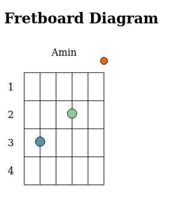

# Fretboard Diagram

A simple tool for creating fretboard diagrams.
Look at example.html for an example.

## Install

```
git clone https://github.com/zazzerino/fretboard-diagram.git
cd fretboard-diagram/
npm install
npm run start
```

Then, open example.html in a browser window.

After updating the source (one of the files in src/), reload the page to see changes.

You should probably read the src files in this order: `types.ts` -> `svg.ts` -> `index.ts`.

`index.ts` exports `makeFretboardDiagram`, which is the main function.

Run `npm run build` to create an optimized version of the library in a single file in dist/.



## Example Usage

    <script type="text/javascript">
      /**
       * ZPiDER's answer from https://stackoverflow.com/questions/1484506/random-color-generator
       */
      const randomColor = () => '#' + ((1 << 24) * Math.random() | 0).toString(16);
    
      const dots = [
        {string: 5, fret: 3, color: randomColor()},
        {string: 3, fret: 2, color: randomColor()},
        {string: 1, fret: 0, color: randomColor()},
      ];
    
      const opts = {
        dots,
        showFretNums: true,
        label: 'Amin',
        onClick: coord => console.log(`clicked on string: ${coord.string}, fret: ${coord.fret}`)
      };
    
      const diagram = makeFretboardDiagram(opts);
      console.log(diagram);
    
      const div = document.getElementById('Am-diagram');
      div.appendChild(diagram);
    </script>

## Thanks
- Joe Harris, for a nearest neighbor algorithm

# TSDX User Guide

Congrats! You just saved yourself hours of work by bootstrapping this project with TSDX. Let’s get you oriented with what’s here and how to use it.

> This TSDX setup is meant for developing libraries (not apps!) that can be published to NPM. If you’re looking to build a Node app, you could use `ts-node-dev`, plain `ts-node`, or simple `tsc`.

> If you’re new to TypeScript, checkout [this handy cheatsheet](https://devhints.io/typescript)

## Commands

TSDX scaffolds your new library inside `/src`.

To run TSDX, use:

```bash
npm start # or yarn start
```

This builds to `/dist` and runs the project in watch mode so any edits you save inside `src` causes a rebuild to `/dist`.

To do a one-off build, use `npm run build` or `yarn build`.

To run tests, use `npm test` or `yarn test`.

## Configuration

Code quality is set up for you with `prettier`, `husky`, and `lint-staged`. Adjust the respective fields in `package.json` accordingly.

### Jest

Jest tests are set up to run with `npm test` or `yarn test`.

### Bundle Analysis

[`size-limit`](https://github.com/ai/size-limit) is set up to calculate the real cost of your library with `npm run size` and visualize the bundle with `npm run analyze`.

#### Setup Files

This is the folder structure we set up for you:

```txt
/src
  index.tsx       # EDIT THIS
/test
  blah.test.tsx   # EDIT THIS
.gitignore
package.json
README.md         # EDIT THIS
tsconfig.json
```

### Rollup

TSDX uses [Rollup](https://rollupjs.org) as a bundler and generates multiple rollup configs for various module formats and build settings. See [Optimizations](#optimizations) for details.

### TypeScript

`tsconfig.json` is set up to interpret `dom` and `esnext` types, as well as `react` for `jsx`. Adjust according to your needs.

## Continuous Integration

### GitHub Actions

Two actions are added by default:

- `main` which installs deps w/ cache, lints, tests, and builds on all pushes against a Node and OS matrix
- `size` which comments cost comparison of your library on every pull request using [`size-limit`](https://github.com/ai/size-limit)

## Optimizations

Please see the main `tsdx` [optimizations docs](https://github.com/palmerhq/tsdx#optimizations). In particular, know that you can take advantage of development-only optimizations:

```js
// ./types/index.d.ts
declare var __DEV__: boolean;

// inside your code...
if (__DEV__) {
  console.log('foo');
}
```

You can also choose to install and use [invariant](https://github.com/palmerhq/tsdx#invariant) and [warning](https://github.com/palmerhq/tsdx#warning) functions.

## Module Formats

CJS, ESModules, and UMD module formats are supported.

The appropriate paths are configured in `package.json` and `dist/index.js` accordingly. Please report if any issues are found.

## Named Exports

Per Palmer Group guidelines, [always use named exports.](https://github.com/palmerhq/typescript#exports) Code split inside your React app instead of your React library.

## Including Styles

There are many ways to ship styles, including with CSS-in-JS. TSDX has no opinion on this, configure how you like.

For vanilla CSS, you can include it at the root directory and add it to the `files` section in your `package.json`, so that it can be imported separately by your users and run through their bundler's loader.

## Publishing to NPM

We recommend using [np](https://github.com/sindresorhus/np).
